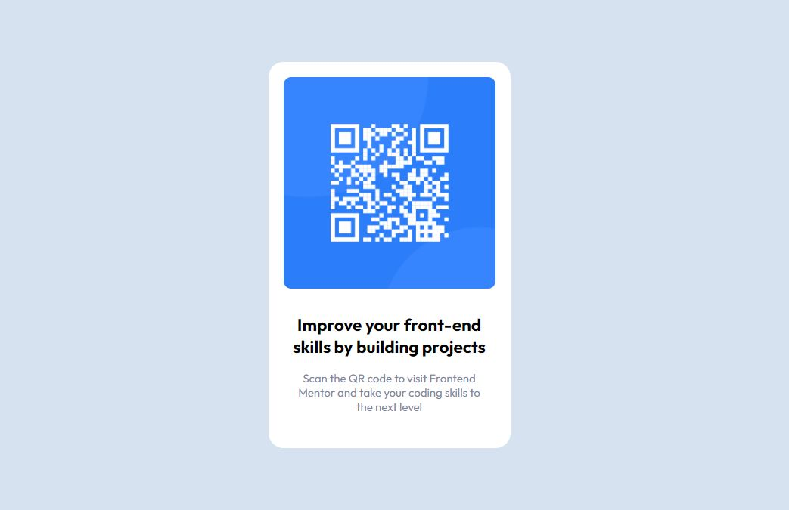

# Frontend Mentor - QR code component solution

This is my solution to the [QR code component challenge on Frontend Mentor](https://www.frontendmentor.io/challenges/qr-code-component-iux_sIO_H)

## Table of contents

  - [Screenshot](#screenshot)
  - [Built with](#built-with)

### Screenshot

### Built with

- Semantic HTML5 markup
<<<<<<< HEAD
- CSS custom properties
=======
- CSS custom properties
>>>>>>> e3436ce4d68ab422a2d65afccb8dcc3343436961
